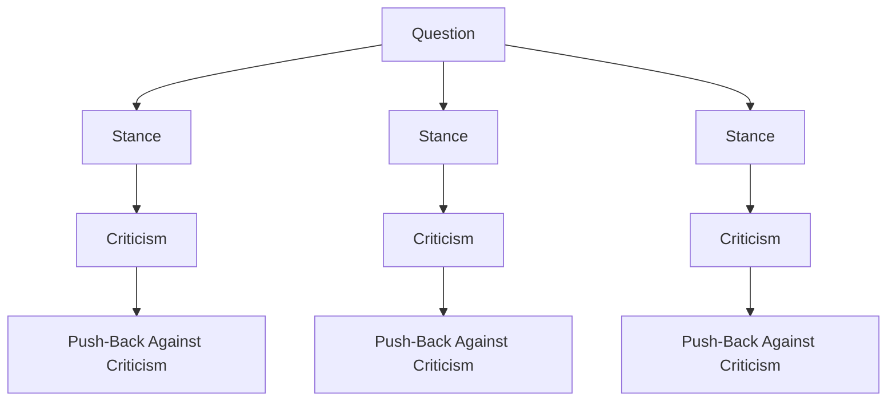

# DebateTree
A langchain app to visualise a debate using LLMs and Langchain. Inspired by Tree-of-Thought reasoning.

Things to add:

1) Add agents and parallelisation to reduce computation time.
2) Make arguments more readable and concise.
3) Make criticisms clearer and first principle based
4) Make push-backs clearer such that the push-back nodes can only be of 3 types:
   - Green nodes that disgaree with the criticism and validate the argument
   - Red nodes that agree with the criticism and invalidate the argument
   - Orange nodes that reduce the debate on the argument to a fundamental question that can be further debated.
5) Functionality to explore a new question.
