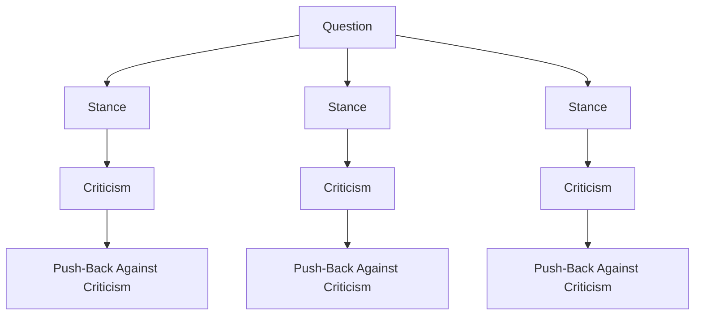

# DebateTree
A langchain app to visualise a debate using Tree-of-Thought reasoning

```mermaid
graph TB
    A["Question"] --> B1["Stance"]
    A["Question"] --> B2["Stance"]
    A["Question"] --> B3["Stance"]
    B1 --> C1[Criticism]
    B2 --> C2[Criticism]
    B3 --> C3[Criticism]
    C1 --> D1[Push-Back Against Criticism]
    C2 --> D2[Push-Back Against Criticism]
    C3 --> D3[Push-Back Against Criticism]
    
```
